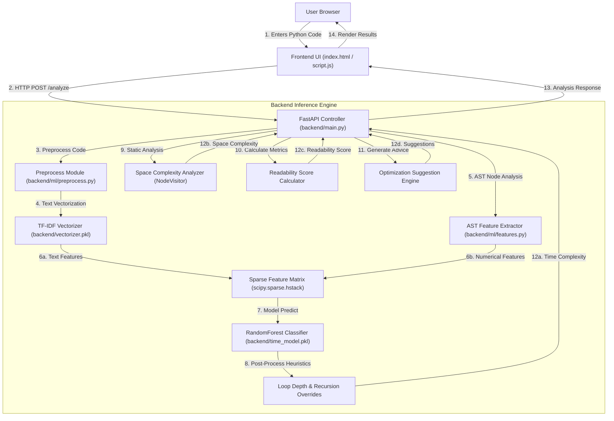

# Complexify — AI Code Complexity Analyzer


Complexify is a full-stack, machine-learning-assisted code analysis platform designed to inspect Python code snippets and evaluate execution efficiency, memory utilization, maintainability, and code structure.

By combining Natural Language Processing (TF-IDF tokenization), Abstract Syntax Tree (AST) static analysis, and Random Forest Machine Learning models, Complexify provides feedback on time complexity, space complexity, readability, and actionable refactoring suggestions.

---

## Table of Contents

- [Overview](#overview)
- [Key Features](#key-features)
- [Tech Stack](#tech-stack)
- [System Architecture](#system-architecture)
- [Project Directory Structure](#project-directory-structure)
- [API Specification](#api-specification)
- [Machine Learning and Analysis Engine](#machine-learning-and-analysis-engine)
- [Environment Configuration](#environment-configuration)
- [Local Setup and Installation](#local-setup-and-installation)
- [Running the Application](#running-the-application)
- [Retraining the Machine Learning Models](#retraining-the-machine-learning-models)

---

## Overview

Developers often need immediate insight into how efficiently their code will execute and how easily it can be maintained. Complexify bridges statistical machine learning predictions with deterministic AST rule inspection to deliver:

1. **Time Complexity Classification**: Predicts Big-O time complexity (e.g., O(1), O(n), O(n^2), O(n^3), O(2^n)).
2. **Space Complexity Estimation**: Determines memory usage trends including dynamic collection growth and recursive stack depth.
3. **Readability & Maintainability Score**: Computes a normalized 0 to 100 score derived from Halstead Volume, Source Lines of Code (SLOC), comment ratio, and cyclomatic branch points.
4. **Actionable Optimization Suggestions**: Identifies performance bottlenecks such as deep loop nesting, recursive overhead, missing comprehensions, and excessive conditional branching.

---

## Key Features

- **Hybrid Prediction Engine**: Integrates trained `RandomForestClassifier` models with AST structural heuristics for deterministic rule overrides (e.g., verifying exact loop depth and recursive function calls).
- **AST Static Analysis**: Parses code into abstract syntax trees to count AST node occurrences (loops, functions, binary operations, branch conditionals, return statements, assignments).
- **Custom Space Complexity Analyzer**: Features an AST `NodeVisitor` that detects array/collection multiplications, `.append()` / `.extend()` operations inside loops, list/dict comprehensions, and recursive stack allocation.
- **Maintainability Index Formulation**: Uses modified Halstead volume metrics and tokenized line analysis to evaluate code readability.
- **RESTful API**: Fast and minimal API powered by FastAPI with CORS middleware support and Pydantic schema validation.
- **Modern Dark-Mode Frontend**: Clean, responsive interface built with native HTML5, CSS custom properties, Google Fonts (*Inter* & *Fira Code*), and asynchronous JavaScript.

---

## Tech Stack

### Backend
| Component | Technology | Version | Purpose |
| :--- | :--- | :--- | :--- |
| **Language** | Python | `3.9+` | Core backend runtime |
| **Framework** | FastAPI | `0.104.1` | REST API framework and endpoint routing |
| **ASGI Server** | Uvicorn | `0.24.0` | Asynchronous web server |
| **Data Validation** | Pydantic | Built-in | Request and response schema enforcement |
| **Environment** | python-dotenv | `1.0.1` | Application settings management |

### Machine Learning & Data Science
| Component | Technology | Version | Purpose |
| :--- | :--- | :--- | :--- |
| **ML Models** | Scikit-Learn | `1.3.2` | `RandomForestClassifier`, `RandomForestRegressor`, `LabelEncoder` |
| **NLP** | TfidfVectorizer | `1.3.2` | Code text feature extraction (max 300 features) |
| **Data Manipulation** | Pandas & NumPy | `2.1.3` / `1.26.2` | Dataset parsing and numerical feature array formatting |
| **Sparse Matrices** | SciPy | `1.11.4` | Combining TF-IDF text features with AST numerical features |
| **Code Metrics** | Radon | *(Dev dependency)* | Extracting cyclomatic complexity and maintainability index for dataset labeling |
| **Model Persistence** | Pickle | Native | Serialized `.pkl` model storage |

### Frontend
| Component | Technology | Purpose |
| :--- | :--- | :--- |
| **Markup** | HTML5 | Semantic structural layout |
| **Styling** | Vanilla CSS3 | Dark-themed design system, flexbox, CSS grid, CSS variables |
| **Logic** | JavaScript (ES6+) | Async fetch requests (`POST /analyze`), DOM manipulation, dynamic state rendering |
| **Typography** | Google Fonts | *Inter* (UI text) and *Fira Code* (Code editor input) |

---

## System Architecture

### Request & Data Flow



### Flow Breakdown
1. **Input Submission**: The user submits Python source code via the frontend web interface.
2. **Preprocessing**: The code is normalized—comments are removed, text is lowercased, punctuation/symbols are stripped, and English stop words are filtered.
3. **Feature Extraction**:
   - **Textual Features**: Transformed into a sparse vector using `TfidfVectorizer` (300 max features).
   - **AST Features**: Extracted using Python's native `ast` module (loop counts, branch statements, binary operations, recursion occurrences, max loop depth).
4. **Time Complexity Prediction**: The combined feature vector is evaluated by a trained `RandomForestClassifier`. A post-processing rule layer refines predictions based on strict AST loop depth and recursion logic.
5. **Space Complexity Analysis**: An AST `NodeVisitor` traverses code nodes to detect list/dict allocations, `.append()` calls inside loops, halving loops, and recursion call stack depth.
6. **Readability & Optimization**: Computes maintainability scores and generates human-readable refactoring suggestions.

---

## Project Directory Structure

```text
Complexify/
├── backend/
│   ├── ml/
│   │   ├── __init__.py           # Package initializer
│   │   ├── features.py           # AST feature extraction, space complexity visitor, readability & suggestions
│   │   ├── models.py             # Loads pickled ML models and vectorizers
│   │   ├── preprocess.py         # Code cleaning, tokenization, and stop-word removal
│   │   └── train.py              # Script to retrain models using the dataset
│   ├── config.py                 # Configuration settings loader (.env reader)
│   ├── main.py                   # FastAPI application routes & middleware setup
│   ├── test_sample.py            # Sample Python snippets for manual testing
│   ├── cyclo_model.pkl           # Trained Cyclomatic Complexity model
│   ├── read_model.pkl            # Trained Readability score model
│   ├── time_encoder.pkl          # Trained LabelEncoder for time complexity classes
│   ├── time_model.pkl            # Trained RandomForestClassifier for time complexity
│   └── vectorizer.pkl            # Trained TF-IDF Vectorizer
├── dataset/
│   └── python_data.jsonl         # Training dataset containing code snippets and complexity labels
├── frontend/
│   ├── index.html                # Single-page web interface HTML
│   ├── script.js                 # Frontend API handler & DOM updater
│   └── style.css                 # Custom CSS variables & modern dark mode styling
├── .env.example                  # Environment configuration template
├── .gitignore                    # Git ignore configuration
├── README.md                     # Project documentation
└── requirements.txt              # Backend Python dependencies
```

---

## API Specification

### Base URL
`http://127.0.0.1:8000`

---

### Endpoints

#### 1. Health Check
Checks if the backend API service is running.

- **Method**: `GET`
- **Endpoint**: `/`
- **Authentication**: None

**Response:**
```json
{
  "status": "Complexify API is running"
}
```

---

#### 2. Analyze Code Snippet
Analyzes submitted Python source code and returns complexity metrics and optimization suggestions.

- **Method**: `POST`
- **Endpoint**: `/analyze`
- **Headers**: `Content-Type: application/json`
- **Authentication**: None

**Request Body:**
```json
{
  "code": "def matrix_multiply(A, B):\n    result = [[0 for _ in range(len(B[0]))] for _ in range(len(A))]\n    for i in range(len(A)):\n        for j in range(len(B[0])):\n            for k in range(len(B)):\n                result[i][j] += A[i][k] * B[k][j]\n    return result"
}
```

**Response (`200 OK`):**
```json
{
  "time_complexity": "cubic",
  "space_complexity": "quadratic",
  "readability_score": 74.32,
  "optimization_suggestions": "Reduce nested loops where possible or reuse precomputed results to lower repeated work."
}
```

---

## Machine Learning and Analysis Engine

### Models & Serialization Artifacts
- **`time_model.pkl`**: A `RandomForestClassifier` trained to categorize code into complexity classes (`constant`, `linear`, `quadratic`, `cubic`, `exponential`, `logarithmic`).
- **`vectorizer.pkl`**: A `TfidfVectorizer` configured with `max_features=300`.
- **`time_encoder.pkl`**: A `LabelEncoder` instance mapping model output indices to time complexity strings.
- **`read_model.pkl` & `cyclo_model.pkl`**: `RandomForestRegressor` models trained on Radon-generated metrics.

### Heuristic Refinements
To guarantee accuracy for deterministic structural patterns, `backend/main.py` applies post-ML AST rule adjustments:
- **Loop Depth >= 3** (without recursion) -> `cubic`
- **Loop Depth = 2** (without recursion) -> `quadratic`
- **Loop Depth = 1** with low ML predictions -> `linear`
- **Loop Depth = 0** (without recursion) -> `constant`
- **Recursion Count >= 2** (without loops) -> `exponential`

---

## Environment Configuration

Configuration options are managed using `python-dotenv`. A template file `.env.example` is provided in the repository root.

### `.env.example`
```env
APP_TITLE=Complexify
APP_VERSION=0.1.0
APP_DESCRIPTION=AI-powered Code Complexity Analyzer using ML + NLP
CORS_ORIGINS=*

DATASET_PATH=dataset/python_data.jsonl
```

### Environment Variables
| Variable | Default Value | Description |
| :--- | :--- | :--- |
| `APP_TITLE` | `Complexify` | Title displayed in FastAPI metadata |
| `APP_VERSION` | `0.1.0` | Application version string |
| `APP_DESCRIPTION` | `AI-powered Code Complexity Analyzer using ML + NLP` | API description string |
| `CORS_ORIGINS` | `*` | Allowed CORS origins (comma-separated list or `*`) |
| `DATASET_PATH` | `dataset/python_data.jsonl` | Relative or absolute path to the training dataset |

---

## Local Setup and Installation

### Prerequisites
- **Python**: Version `3.9` or higher installed on your system.
- **Web Browser**: Any modern browser (Chrome, Firefox, Edge, Safari).

### Step 1: Clone or Navigate to the Repository
```bash
cd d:\Projects\Complexify
```

### Step 2: Set Up Environment File
Copy the example `.env.example` file to `.env`:
```powershell
copy .env.example .env
```

### Step 3: Create and Activate Virtual Environment
```powershell
# Create virtual environment
python -m venv venv

# Activate on Windows (PowerShell)
.\venv\Scripts\Activate.ps1

# Activate on Linux/macOS
# source venv/bin/activate
```

### Step 4: Install Dependencies
```powershell
pip install -r requirements.txt
```

---

## Running the Application

### 1. Start the Backend API Server
Run the FastAPI application using Uvicorn from the project root:

```powershell
python -m uvicorn backend.main:app --reload --port 8000
```

Verify backend health by opening `http://127.0.0.1:8000/` in your browser or running:
```powershell
curl http://127.0.0.1:8000/
```
Expected output:
```json
{"status":"Complexify API is running"}
```

---

### 2. Launch the Frontend
Since the frontend is built with static web technologies, you can open `index.html` directly in your browser:

#### Option A: Direct File Open
```powershell
cd frontend
start index.html
```

#### Option B: Local HTTP Server (Optional)
```powershell
cd frontend
python -m http.server 3000
```
Then navigate to `http://127.0.0.1:3000` in your web browser.

---

## Retraining the Machine Learning Models

If you update the dataset (`dataset/python_data.jsonl`) or modify feature extraction rules, you can retrain and export new model pickle files.

### Prerequisites for Retraining
The training script requires `radon` to compute baseline metrics for raw snippets:
```powershell
pip install radon
```

### Run the Training Pipeline
Execute the training module from the project root directory:

```powershell
python -m backend.ml.train
```

### Training Pipeline Execution Steps:
1. Loads dataset from `DATASET_PATH` (defaults to `dataset/python_data.jsonl`).
2. Calculates baseline Cyclomatic Complexity (`cc_visit`) and Maintainability Index (`mi_visit`) via Radon.
3. Extracts AST structural features (`extract_ast_features`).
4. Preprocesses and tokenizes raw Python code (`preprocess_code`).
5. Fits `TfidfVectorizer` (300 max features) and combines text features with AST numerical features.
6. Fits `RandomForestClassifier` for time complexity and `RandomForestRegressor` models for cyclomatic and readability metrics.
7. Saves updated model artifacts (`vectorizer.pkl`, `time_model.pkl`, `cyclo_model.pkl`, `read_model.pkl`, `time_encoder.pkl`) into `backend/`.
